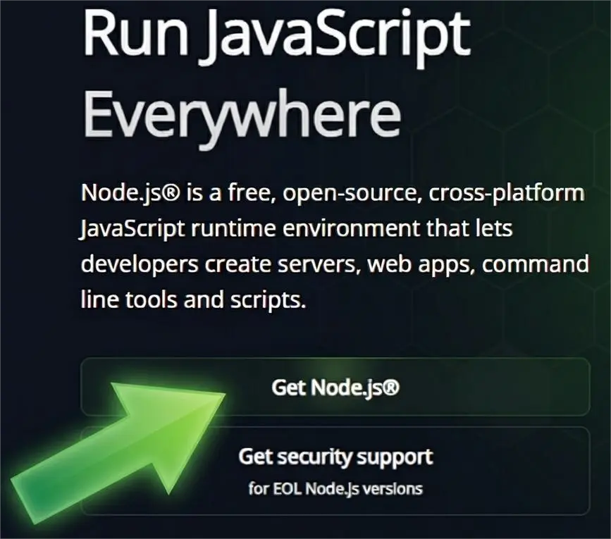
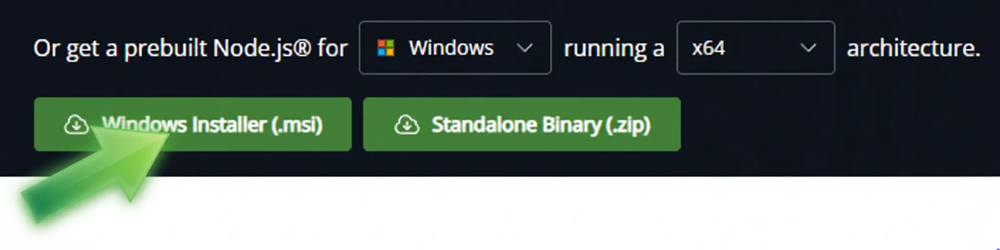

# How to Use Codex CLI with LLM Foundry + Public APIs (Windows 11)

These are instructions to set up

- [Codex](https://openai.com/codex/)
- on [Visual Studio Code (VS Code)](https://code.visualstudio.com/) using
- in Windows 11
- using **LLM Foundry** (Straive’s API router) and **Public APIs** (OpenAI, OpenRouter)

You don't need admin access or OpenAI API keys.

---

## 1. Install prerequisites

### Option A — Install via official installer (easiest)

1. Open the Node.js download page: https://nodejs.org/
2. Download **LTS** (click on Get Nodejs)

3. Download and Run the **.msi** installer → keep defaults (make sure it includes **npm**)
4. Restart your terminal (**Command Prompt** / **PowerShell**).

    ### Verify Installation

    ```bash 
    node -v
    npm -v
    ```
### Option B (recommended): Use WSL (Ubuntu)
Codex CLI works best in a Linux-like shell.

1. Install WSL + Ubuntu from Microsoft Store
2. Open **Ubuntu** (WSL) and run:

```bash
sudo apt update
sudo apt install -y nodejs npm
node -v
npm -v
```

> If your Ubuntu repo has an older Node.js, install a newer Node via NodeSource or nvm.


---

## 1. Install VS Code

Download [Visual Studio Code](https://code.visualstudio.com/) and install it.

[](https://youtu.be/cu_ykIfBprI)

Then open any folder in VS Code.


## 2. Install Codex CLI

Open Vs code and click on the three dots and follow this path Three dots -> Terminal -> New Terminal


Install globally:(Enter Below command in the Terminal and Hit Enter)

```bash
npm i -g @openai/codex
```

Verify:

```bash
codex --help
```

---

## 3. Create Codex CLI config Or Search for .codex folder config.toml file and Edit it.

Codex CLI reads:

- **Linux/WSL:** `~/.codex/config.toml`
- **Windows (PowerShell):** `%USERPROFILE%\.codex\config.toml`

### Create the folder + file

**WSL / Linux**
```bash
mkdir -p ~/.codex
nano ~/.codex/config.toml
```

**PowerShell**
```powershell
mkdir $env:USERPROFILE\.codex -Force
notepad $env:USERPROFILE\.codex\config.toml
```

---

## 4. Paste this `config.toml` (profiles)

Paste the following into `config.toml` and save:

```toml
# ===== Default profile (switch per test using: codex -p <profile>) =====
profile = "llmfoundry_openai"

# ----------------------------
# LLM Foundry (Straive router)
# ----------------------------
[profiles.llmfoundry_openai]
model_provider = "llmfoundry_openai"
model = "gpt-5.2"  # change if your Foundry catalog differs

[model_providers.llmfoundry_openai]
name = "LLM Foundry - OpenAI"
base_url = "https://llmfoundry.straive.com/openai/v1"
env_key = "LLMFOUNDRY_TOKEN"
wire_api = "responses"

[profiles.llmfoundry_azure]
model_provider = "llmfoundry_azure"
# IMPORTANT: Azure typically wants the *deployment name* here
model = "gpt-5"

[model_providers.llmfoundry_azure]
name = "LLM Foundry - Azure"
base_url = "https://llmfoundry.straive.com/azure/openai/deployments/gpt-5"
env_key = "LLMFOUNDRY_TOKEN"
wire_api = "chat"
query_params = { api-version = "2025-04-01-preview" }

[profiles.llmfoundry_gemini]
model_provider = "llmfoundry_gemini"
model = "gemini-2.5-flash"

[model_providers.llmfoundry_gemini]
name = "LLM Foundry - Gemini"
base_url = "https://llmfoundry.straive.com/gemini/v1beta/openai"
env_key = "LLMFOUNDRY_TOKEN"
wire_api = "chat"

[profiles.llmfoundry_openrouter]
model_provider = "llmfoundry_openrouter"
model = "openai/gpt-5-codex"

[model_providers.llmfoundry_openrouter]
name = "LLM Foundry - OpenRouter"
base_url = "https://llmfoundry.straive.com/openrouter/v1"
env_key = "LLMFOUNDRY_TOKEN"
wire_api = "chat"

# ----------------------------
# Public APIs (direct)
# ----------------------------
[profiles.public_openai]
model_provider = "public_openai"
model = "gpt-5.2" # use what your OpenAI account has access to

[model_providers.public_openai]
name = "OpenAI (Public)"
base_url = "https://api.openai.com/v1"
env_key = "OPENAI_API_KEY_PUBLIC"
wire_api = "responses"

[profiles.public_openrouter]
model_provider = "public_openrouter"
model = "openai/gpt-4o" # example; pick any OpenRouter model id

[model_providers.public_openrouter]
name = "OpenRouter (Public)"
base_url = "https://openrouter.ai/api/v1"
env_key = "OPENROUTER_API_KEY"
wire_api = "chat"


```

> Any changes to `config.toml` require restarting your terminal session (and sometimes restarting VS Code if you’re using its terminal).

---

## 5. Set your LLM Foundry API key

Visit [LLM Foundry](https://llmfoundry.straive.com/) and log in with your official Google account.

Then click on the "Code" tab.


Copy the LLM Foundry token.


Search for "Edit environment variables for your account" in the Windows search bar.


Select "New" from the "User variables" section.


Set the variable name to:

`LLMFOUNDRY_TOKEN`

**CAREFULLY**! Copy paste it. Or, if typing:

- Use **upper case** (it's `LLMFOUNDRY` not `llmfoundry`).
- Spell it **correctly** (it's `LLMFOUNDRY` not `LLMFOUNDARY`).
- Don't forget the underscore (it's `LLMFOUNDRY_TOKEN` not `LLMFOUNDRY TOKEN`).

Set the variable value to the token you copied from [LLM Foundry > Code](https://llmfoundry.straive.com/code).

[](https://youtu.be/wbUdbhf7HbI)


Similarly Add you Env Variables for Below:
- OPENAI_API_KEY_PUBLIC
- OPENROUTER_API_KEY
- GEMINI_API_KEY


## 6. Restart VS Code

Close VS Code.

Then re-open it.

## 7. Verify Codex CLI is working (Anand “Hi” smoke test)

Run these one by one. Each should respond.

### Default profile
```bash
codex "Hi"
```

### LLM Foundry profiles
```bash
codex -p llmfoundry_openai "Hi"
codex -p llmfoundry_azure "Hi"
codex -p llmfoundry_gemini "Hi"
codex -p llmfoundry_openrouter "Hi"
```

### Public API profiles
```bash
codex -p public_openai "Hi"
codex -p public_openrouter "Hi"
```

If you get a response like “Hi, how can I help?”, the end-to-end test passed.

---