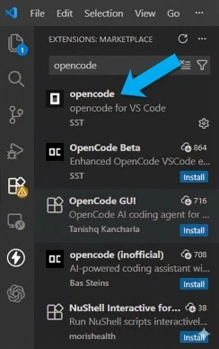
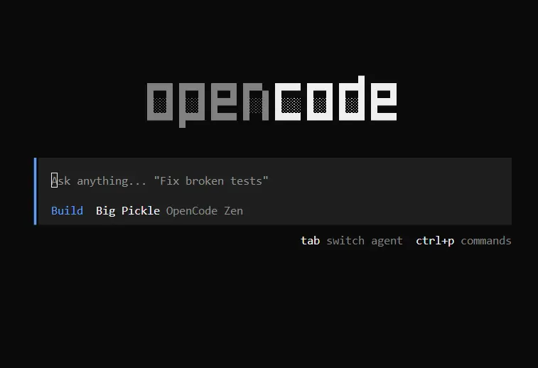
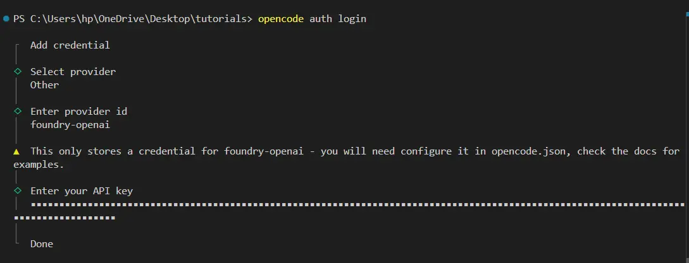
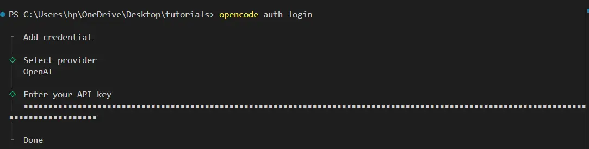
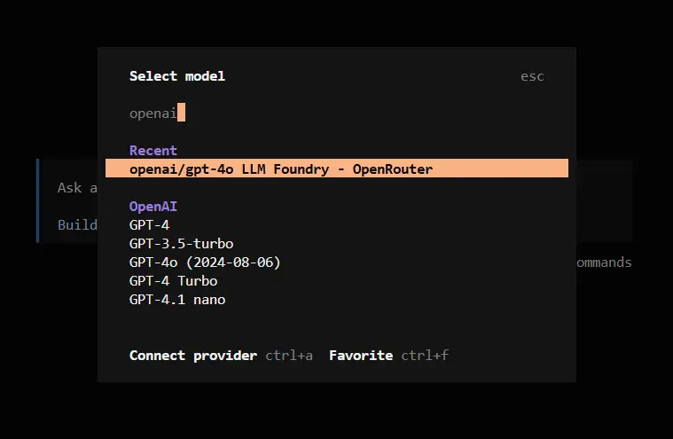

# How to Use OpenCode with LLM Foundry + Public APIs (Windows 11)

This guide helps you set up **OpenCode** to work across:

- **LLM Foundry APIs** (Straive router): OpenAI, Azure OpenAI, Gemini, OpenRouter
- **Public APIs**: OpenAI, Anthropic, OpenRouter


---

## 1. Install VS Code

Download [Visual Studio Code](https://code.visualstudio.com/) and install it.

[](https://youtu.be/cu_ykIfBprI)

Then open any folder in VS Code.


## 2. Install Codex

Select the Extensions icon in the sidebar. Search for "Opencode" in the search bar and install it.



After Installing it Press ctrl + shift + P then write (open opencode) and press Enter 



## 2) Where OpenCode stores config 

**Global config (for all projects)**  
   - Windows: `C:\Users\<you>\.config\opencode\opencode.json`  
   - Linux/macOS: `~/.config/opencode/opencode.json`

---

## 3) Add credentials (API keys) for providers

Run:
```powershell
opencode auth login
```

### 3.1 Add LLM Foundry credentials (repeat 4 times)

Each time:
- Select provider: **Other**
- Enter provider id: one of the following
- Enter your API key: paste your **LLMFOUNDRY_TOKEN** (same token every time)

Do these 4 credentials:

1) `foundry-openai`  
2) `foundry-openrouter`  
3) `foundry-gemini`  
4) `foundry-azure`



### 3.2 Add Public API credentials (repeat per provider)

Run `opencode auth login` again and add:

- Provider: **OpenAI** (built-in) → paste your OpenAI key
- Provider: **OpenRouter** (built-in) → paste your OpenRouter key
- Provider: **Anthropic** (built-in) → paste your Anthropic key



---

## 4) Create global `opencode.json` (LLM Foundry endpoints)

Create the folder (if needed) and open the file:

```powershell
mkdir $env:USERPROFILE\.config\opencode -Force
notepad $env:USERPROFILE\.config\opencode\opencode.json
```

Paste the following **complete** config and save:

```json
{
  "$schema": "https://opencode.ai/config.json",
  "provider": {
    "foundry-openai": {
      "npm": "@ai-sdk/openai-compatible",
      "name": "LLM Foundry - OpenAI",
      "options": {
        "baseURL": "https://llmfoundry.straive.com/openai/v1"
      },
      "models": {
        "gpt-5": { "name": "gpt-5" },
        "gpt-5-mini": { "name": "gpt-5-mini" }
      }
    },
    "foundry-openrouter": {
      "npm": "@ai-sdk/openai-compatible",
      "name": "LLM Foundry - OpenRouter",
      "options": {
        "baseURL": "https://llmfoundry.straive.com/openrouter/v1"
      },
      "models": {
        "openai/gpt-5-codex": { "name": "openai/gpt-5-codex" },
        "openai/gpt-4o": { "name": "openai/gpt-4o" }
      }
    },
    "foundry-gemini": {
      "npm": "@ai-sdk/openai-compatible",
      "name": "LLM Foundry - Gemini",
      "options": {
        "baseURL": "https://llmfoundry.straive.com/gemini/v1beta/openai"
      },
      "models": {
        "gemini-2.5-flash": { "name": "gemini-2.5-flash" }
      }
    },
    "foundry-azure": {
      "npm": "@ai-sdk/openai-compatible",
      "name": "LLM Foundry - Azure",
      "options": {
        "baseURL": "https://llmfoundry.straive.com/azure/openai/deployments/gpt-5",
        "queryParams": {
          "api-version": "2025-04-01-preview"
        }
      },
      "models": {
        "gpt-5": {
          "name": "gpt-5",
        }
      }

    },
    "foundry-anthropic": {
      "npm": "@ai-sdk/openai-compatible",
      "name": "LLM Foundry - Anthropic",
      "options": {
        "baseURL": "https://llmfoundry.straive.com/anthropic/v1"
      },
      "models": {
        "claude-sonnet-4": { "name": "claude-sonnet-4" }
      }
    }
  }
}

```

Notes:
- The 4 `foundry-*` providers are **OpenAI-compatible** endpoints behind LLM Foundry.

---

## 5) Restart OpenCode

Close and reopen your terminal (important after config/credential changes).

---

## 6) Verify (smoke test)

Select models by Entering /models in the Opencoden and start using it.


OR Run these one by one:

```powershell
opencode run -m foundry-openai/gpt-5.2 "Hi"
opencode run -m foundry-openrouter/openai/gpt-5-codex "Hi"
opencode run -m foundry-gemini/gemini-2.5-flash "Hi"
```

---
